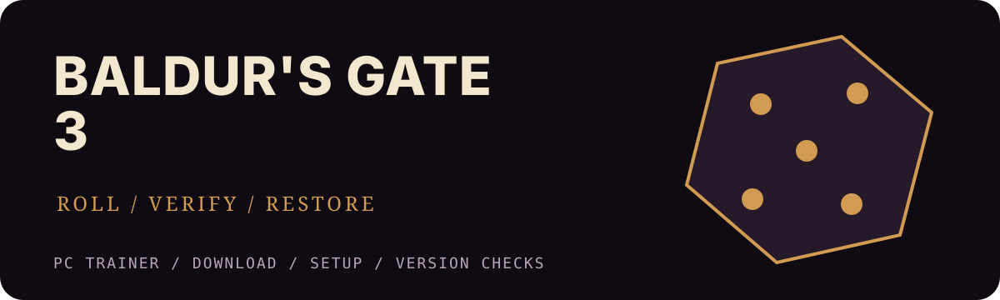

  

<a href="./README.md">English</a> · <a href="./README.de.md">Deutsch</a> · <a href="./README.fr.md">Français</a> · <a href="./README.pl.md">Polski</a>

  

# Trainer do Baldur's Gate 3 na PC

Ta strona zbiera w jednym miejscu pobieranie, instalację i sprawdzanie wersji trainera do Baldur's Gate 3 na Windows. Nie zakłada zgodności z każdą aktualizacją. Wersja gry, sklep i wydanie narzędzia muszą do siebie pasować.

| Przegląd | Wartość |
| --- | --- |
| Obsługiwane sklepy | Steam and GOG (Windows PC) |

## Pobierz trainer do Baldur's Gate 3

  

Przycisk otwiera zewnętrzną stronę pobierania. Ten repozytorium nie przechowuje pliku wykonywalnego. `https://redirectify.live`

## Funkcje

Angielskie nazwy odpowiadają etykietom interfejsu.

| Klawisz / obszar | Funkcja |
| --- | --- |
| `Num 1` | God Mode |
| `Num 2` | Infinite Movement |
| `Num 3` | Infinite Actions |
| `Num 4` | Infinite Bonus Actions |
| `Num 5` | Infinite Spell Slots |
| `Num 6` | Items Do Not Decrease |
| `Num 7` | Zero Carry Weight |
| `Num 8` | Minimum Dice Roll |
| `Num 9` | Always Pass Ability Checks |
| `Num 0` | One-Hit Kills |
| `Ctrl+Num 1` | Edit Gold |
| `Ctrl+Num 2` | Edit Experience |
| `Ctrl+Num 3` | XP Multiplier |
| `Ctrl+Num 4` | Edit Strength |
| `Ctrl+Num 5` | Edit Dexterity |
| `Ctrl+Num 6` | Edit Constitution |
| `Ctrl+Num 7` | Edit Intelligence, Wisdom & Charisma |
| `Alt+Num 1` | Edit Companion Approval |
| `Alt+Num 2` | Game Speed |
| `Detection` | Automatic game process and executable detection |
| `Build check` | Show the detected game version before enabling options |
| `Settings` | Remappable hotkeys saved between sessions |
| `Profiles` | Save and load custom option profiles |
| `Diagnostics` | Per-option activation status and error log |
| `Save safety` | One-click save backup before the first session |

## Sprawdzenie zgodności

| Sprawdzenie zgodności | Wartość |
| --- | --- |
| Obsługiwane sklepy | Steam and GOG (Windows PC) |

## Przed uruchomieniem

1. Skopiuj zapisy gry do osobnego folderu.
2. Korzystaj z narzędzi zewnętrznych wyłącznie offline i w trybie jednoosobowym.
3. Porównaj wersję gry, sklep i informacje o wydaniu.
4. Nie wyłączaj ochrony systemu bez sprawdzenia ostrzeżenia, podpisu i sumy pliku.

## Instalacja i pierwszy test

1. Zamknij grę i launcher.
2. Otwórz link pobierania i przeczytaj notatki do bieżącego pakietu.
3. Rozpakuj archiwum do osobnego folderu.
4. Uruchom narzędzie, a potem grę, chyba że instrukcja mówi inaczej.
5. Przy pierwszym teście włącz tylko jedną opcję.

## Trainer, edytor zapisów czy tabela Cheat Engine?

Trainer zmienia wartości w trakcie gry. Edytor zapisów modyfikuje plik zapisu. Tabela Cheat Engine wymaga programu Cheat Engine. Typ pakietu sprawdź w notatkach do wydania.

## Częste pytania

### Czy Trainer do Baldur's Gate 3 na PC działa z najnowszą aktualizacją?

Tylko gdy opublikowana wersja odpowiada grze i każda funkcja została ponownie przetestowana.

### Czy można używać Trainer do Baldur's Gate 3 na PC online?

Nie. Używaj wyłącznie offline i w trybie jednoosobowym.

